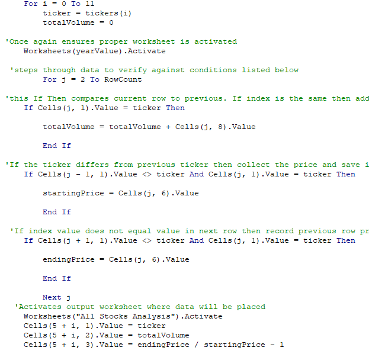
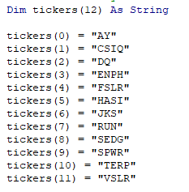

# Stock Analysis Challenge - Green (Eco) Friendly Stocks Analysis For Steve's parents

## Overview of Project
To provide an optimized data analysis tool that will allow Steve the ability to review large number of stocks, capture price over time along with calculated returns in a quick and efficient manner.

### Purpose
Although Steve appreciates our intial deliverable that allows him to evaluate a handful of stocks quickly to help his parents reach their investement goals, he would like us to optimize the code to process the data faster.  This will allow Steve to increase the number of companies he can evaluate without increasing overall time required to process the data and analyze the results.  The remainder of this document will highlight the opportunities for improvement with the existing code and the approach to apply improvements to the code. 

## Analysis and Challenges
The challenge is to take code that works well and find ways to improve upon it so that it works even better.  This requires a review of the existing code and identify opportunities in the code to make improvements so that the tool can handle larger data sets and still produce appropriate analytics in a timely manner.

### Analysis of Original Code

Upon Analysis of original code, there are multiple opportunities for improvement that could improve the speed and reduce computer time and resources to run calculations and output the data. Reviewing the code snippit below one will notice the following:

*  The code operates in a very serial manner. 
*  Per ticker index, code is run one line at a time.  
*  Data is placed in the appropriate column on the designated output work sheet one ticker at a time.

#### Description of Function of Code
    --The code starts with ticker index 0 and runs through each line of code to calculate the volume, then the starting price, then the ending price, and then the post-calculates the return. It then switches over to the Analysis Worksheet in the workbook and out puts the data.  Then it moves back to either the 2017 or 2018 workbook(depending on user selection) and repeats the process for tickers 1 and then 2 and so-on and so-on until it reaches the 12th index. A very serial process that requires movement across multiple tables and sets of data that takes time.  Although it is only fractions of seconds, these fractions add up and equate to slower run times.

### Analysis of Opportunities of improvement
After evaluating the original code above, better use of arrays within the code could greatly improve the performance of this analysis tool.  By using arrays one can store larger sets of data in relation to other arrays.  With a single loop of code more data can be collected and stored in a computer's memory to then be pushed to the output file destination at one time.  

*   The screenshot below can be found in both the original and refractored code. This code allows each stock ticker symbol to be stored to an array and then recalled through indexing.

*   However, by implementing

### Results of Original Code Vs Refactored Code

## Summary

### Advantages and Disadvantages of Refactoring Code

### Advantages and Disadvantages of Projects Original and Refactored code.
Conclusion number one is the month of May appears to be the best month to start a kickstarter campaign and have a successful campaign.  While June and July appear to be the next best option for both starting and having a successful kickstarter.  
The second conclusion is the month of December appears to have the least activity with regards to starting a kickstarter and the lowest success rate.

- What can you conclude about the Outcomes based on Goals?
Based on the Outcomes Based on Goals analysis, one can conclude that there is a a direct connection between the goal amount and whether fund raising campaign is successful or fails.  Goals set too high may not be reached and goals set too low may be insufficient to fund a project.  One must fully understand what is required to fund their projects and must set a number that is appropriate to reach their funding goals. 

- What are some limitations of this dataset?
The dataset as provided in this exercise fails to link the success and failure rates based on the launch month of the kick starter in relation to the goal amount for that kickstarter.  It would be interesting to see if the goals set for the month of May were more in line with a goal level set that have shown higher levels of success as highlighted in the Outcome vs Goals chart. 
Another issue with the dataset provided, is it does not consider any macro or micro economic factors that my impact the success or failure rate of any given kickstarter campaign.  Macro factors such as recessions or micro factors such as less discretionary spending during the holidays than compared to the summer months.

- What are some other possible tables and/or graphs that we could create?
In addition to a table that cross references the range of goals for successful and failed kickstarters in the month of May, a table that shows year over year performances of kickstarters of multiple industries.  This information would prove to be valuable as it could show if certain industries are falling out of favor.  Are kickstarters associated with publishing falling out of favor when compared to technology kickstarters?  How do food kickstarter campaigns success/fail rates over multiple years trend in comparison to theater kickstarters.  This would be helpful to see this historical analysis so if Louise were to decide to have another fundraising campaign in the future, she would be more confident in its likelihood for success.
Another interesting view would be how quickly did the successful kickstart campaign reached their goals.  How many days did it take for successful campaigns to reach their goals in relation to their start dates?  This could be helpful for Louise to set not only a reasonable goal, at the correct time of year, but also to provide it enough time.
