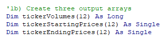
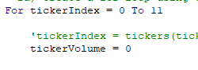
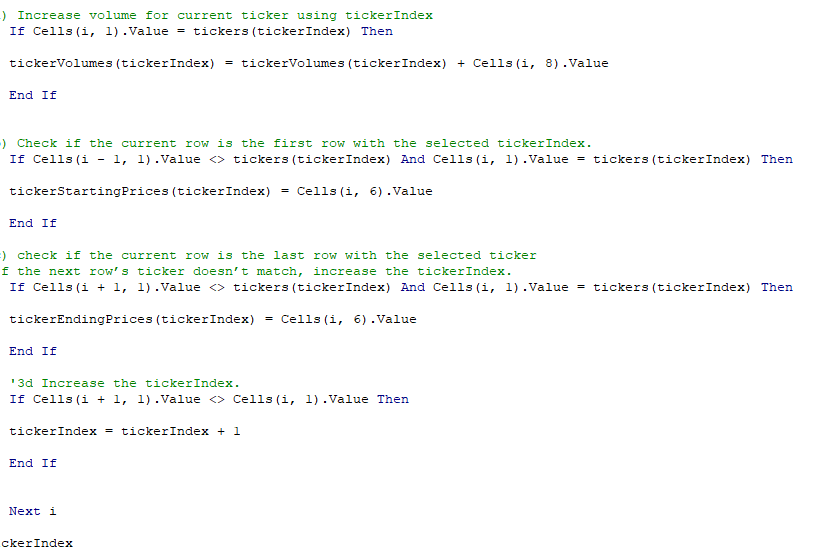
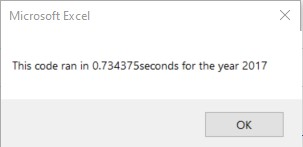
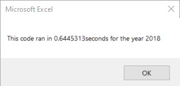
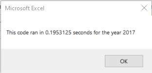
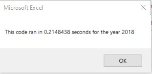

# Stock Analysis Challenge - Green (Eco) Friendly Stocks Analysis For Steve's parents

## Overview of Project
To provide an optimized data analysis tool that will allow Steve the ability to review large number of stocks, capture price over time along with calculated returns in a quick and efficient manner.

### Purpose
Although Steve appreciates our intial deliverable that allows him to evaluate a handful of stocks quickly to help his parents reach their investement goals, he would like us to optimize the code to process the data faster.  This will allow Steve to increase the number of companies he can evaluate without increasing overall time required to process the data and analyze the results.  The remainder of this document will highlight the opportunities for improvement with the existing code and the approach to apply improvements to the code. 

## Analysis and Challenges
The challenge is to take code that works well and find ways to improve upon it so that it works even better.  This requires a review of the existing code and identify opportunities in the code to make improvements so that the tool can handle larger data sets and still produce appropriate analytics in a timely manner.

### Analysis of Original Code

Upon Analysis of original code, there are multiple opportunities for improvement that could improve the speed and reduce computer time and resources to run calculations and output the data. Reviewing the code snippit below one will notice the following:

*  The code operates in a very serial manner. 
*  Per ticker index, code is run one line at a time.  
*  Data is placed in the appropriate column on the designated output work sheet one ticker at a time.

#### Description of Function of Code
More indepth explanation of the points listed above would be as follows; the code starts with ticker index 0 and runs through each line of code to calculate the volume, then the starting price, then the ending price, and then post-calculates the return. It then switches over to the Analysis Worksheet in the workbook and out puts the data.  Then it moves back to either the 2017 or 2018 workbook(depending on user selection) and repeats the process for tickers 1 and then 2 and so-on and so-on until it reaches the final index. A very serial process that requires movement across multiple sheets and multiple sets of data that increases time and need for computer resources.  Although it is only fractions of seconds, these fractions add up and equate to slower run times.  This very serial process can be seen below as data is collected for one ticker index then moved to an output location before returning and collecting data for the next index.

### Analysis of Opportunities of improvement
After evaluating the original code above, better use of arrays within the code could greatly improve the performance of this analysis tool.  By using arrays one can store larger sets of data in relation to other arrays.  With a single loop of code more data can be collected and stored in a computer's memory to then be pushed to the output file destination at one time.  

*   The screenshot below can be found in both the original and refractored code. This code allows each stock ticker symbol to be stored to an array and then recalled through indexing.

*   For the refactored code however, implementing variables for tickervolumes, starting prices and ending prices as seen below, allows the code to temporarily store more data. 
 

*   Then the tickerIndex steps through each tickers index, sets the volume to zero as shown below. 

*  From there the code steps through the data and calculates the volume and stores data for each variable listed above for the respective ticker sympbol and then the ticker index is incremented to the next index.  The snippit of code below shows the index of the tickers through the tickerIndex. It also shows the ticker volumes and starting and ending prices in relation to the respective tickerIndex.

*   Once the last index has been completed and all the data is stored to arrays, the data is then moved to the stock analysis worksheet and placed in the location as dictated by the code. The approach of using arrays proves to be more efficient and faster as time is not lost moving data one by one to the output destination. All data is collected, stored to arrays and then in a single move it is carried to the output destination and the code ends after conditionals are checked and formatting is completed.

### Results of Original Code Vs Refactored Code

The refactoring of code did lead to significant improvement with runtime.  This is visible with the screenshots below taken from the NON-Refactored tool.  The non-refactored code yielded test time results of .74 second for 2017 stock analysis and .64 seconds for 2018 stock analysis.

 , 

While the refactored code using arrays, yielded much faster test times.  The 2017 analysis yielded test time results of .19 seconds and the 2018 analysis yielded test time results of .21 seconds.  Quite an impressive improvement.

 , 

## Summary
In summary, the refactoring of the code was successful and yield substantial runtime reductions that would make Steve happy.  This leads to the question, why would you not refactor all code.  This will be covered briefly in the next section below.

### Advantages and Disadvantages of Refactoring Code
####The advantages of refactoring code are as follows:
* Allows for faster running code
* More efficiently lays out the code
* Makes trouble shooting code easier as it will be easier to read and understand

####Some of the disadvantages of refactoring of code are as follows:
* Can be cumbersome if the program is large.  Harder to read and harder to understand where optimizations need to be made.
* Without fully understanding what is going on with each piece of code, any change made to one piece of code may have negative consequences in other areas of the code
* Once code is refactored, substantial amount of test and code validateion time would be required to make sure that all code is functioning as it should.  
    *Something that some companies may not be willing to spend time and money on.

### Advantages and Disadvantages of Projects Original and Refactored code.
* The advantages of the projects original code is that based on the initial clients request, it met the need.  The layout of the code was sufficient and the test time was negligible considering that the original scope was to support 12 ticker symbols.  One could quickly put code together to support that request and turn around working code with very little effort. Disadvantages of the original code is it did not allow for flexibility and growth.  Clients often times change the scope of the project and request new features and additional capabilities. If the code is structured properly and developed with forward thinking involved, these possible changes can be accounted for early on in the project.

* The advantage of the refactored code for this project is you get well thought out code that will allow you, or those that follow, to add new parameters and additional features that the client may want in the future with minimal effort.  Well written code would allow other programmers to modify your code while you continue to work on the next big deliverable!  Also, the code is easier to understand, read, and runs faster. Allowing the tool to handle larger data sets efficiently and extending the life of the tool.  Disadvantages of the refactored code is that for the inexperienced programmer, it may take a bit longer to create and to validate.  It may also be difficult to ensure the code is refactored in a way that will allow future functionality to be added as it can be difficult anticpating clients requests.

